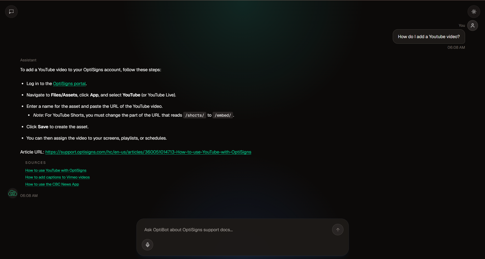

Live site: https://optibot.duydanghoang.dev/



## Repo layout

```text
frontend/   Vite React chat client
backend/    Flask API app and Gemini chat code
scraper/    scraper, sync job, and CLI
```

## Setup

```bash
python -m venv .venv
source .venv/bin/activate      # Windows: .venv\Scripts\activate
pip install -r requirements.txt
cp .env.example .env
```

The root `.env` keeps the required secret plus the settings that commonly vary by environment:

- `GEMINI_API_KEY` is required.
- `GEMINI_FILE_SEARCH_STORE` is optional. Leave it blank on first run and the scraper will create a store, then remember it in `data/state.db`.
- `GEMINI_MODEL` is optional and defaults to `gemini-2.5-flash`.
- `STATE_DB_PATH`, `RUN_ARTIFACT`, and `OUT_DIR` are optional path overrides for different local/container layouts.
- `VITE_DEV_PROXY_TARGET` is optional for local frontend hot-reload dev and defaults to `http://127.0.0.1:8000`.
- `FLASK_HOST`, `FLASK_PORT`, `CORS_ALLOW_ORIGIN`, and `FRONTEND_DIST_DIR` are optional backend deployment overrides.

## Sync the docs

```bash
python scraper/main.py
```

That command:

- fetches all public support articles from Zendesk
- writes normalized Markdown to `data/markdown/<slug>.md`
- tracks `slug`, `article_url`, `content_hash`, `last_seen_at`, and Gemini document/store IDs in SQLite
- uploads only new or changed docs to Gemini File Search
- writes a `last_run.json` artifact with `added`, `updated`, and `skipped`

## Run the API

```bash
python backend/app.py
```

API endpoints:

- `GET /api/health`
- `GET /api/status`
- `POST /api/chat`
- `POST /api/chat/stream`

`POST /api/chat` expects:

```json
{
  "messages": [
    { "role": "user", "content": "How do I add a YouTube video?" }
  ]
}
```

`POST /api/chat/stream` uses Server-Sent Events and streams assistant text incrementally, with citations delivered in the final `done` event.

The backend does not own scraping anymore. `GET /api/status` reports on scraper-produced artifacts in `data/state.db` and `last_run.json`, but running sync happens through the scraper app:

```bash
python scraper/main.py
```

## Frontend

The Vite React frontend now lives in `frontend/`.

Run it with:

```bash
cd frontend
npm install
npm run dev
```

The frontend always uses relative `/api/*` requests. In local dev, Vite proxies them to `VITE_DEV_PROXY_TARGET` from the repo-root `.env`, defaulting to `http://127.0.0.1:8000`.

If `FRONTEND_DIST_DIR` points at a built frontend directory, `python backend/app.py` serves both the API and the compiled SPA.

## Docker

```bash
docker build -f Dockerfile.backend -t pebble-river-backend .
docker build -f Dockerfile.scraper -t pebble-river-scraper .
```

The repo now has service-specific images:

- `Dockerfile.backend` for the Flask API plus the built frontend bundle
- `Dockerfile.scraper` for the cron-driven scraper

## Compose

```bash
docker compose up --build
```

`compose.yml` defines the deployed services:

- `backend` runs the Flask API on `http://127.0.0.1:8000` and serves the built frontend from `frontend/dist`
- `scraper` runs an initial sync on container start and then uses cron to run once per day

The backend and scraper share a named Docker volume mounted at `/var/lib/optibot`, which stores `state.db`, `last_run.json`, and the normalized Markdown files. The scraper service uses `Dockerfile.scraper`, which installs `cron` and schedules `python scraper/main.py` with `SCRAPER_CRON_SCHEDULE`. The default schedule is `0 3 * * *`.

## Sync strategy

The scraper calls Zendesk Help Center articles, converts each article body to clean Markdown, writes `data/markdown/<slug>.md`, and includes an `Article URL:` line for citations. SQLite keeps the local manifest for `article_id`, `slug`, `article_url`, `content_hash`, `last_seen_at`, `gemini_document_name`, and `gemini_file_search_store_name`. On the next run, unchanged hashes are skipped; changed articles upload a replacement Gemini document and delete the old one. Logs include `added`, `updated`, and `skipped`.
